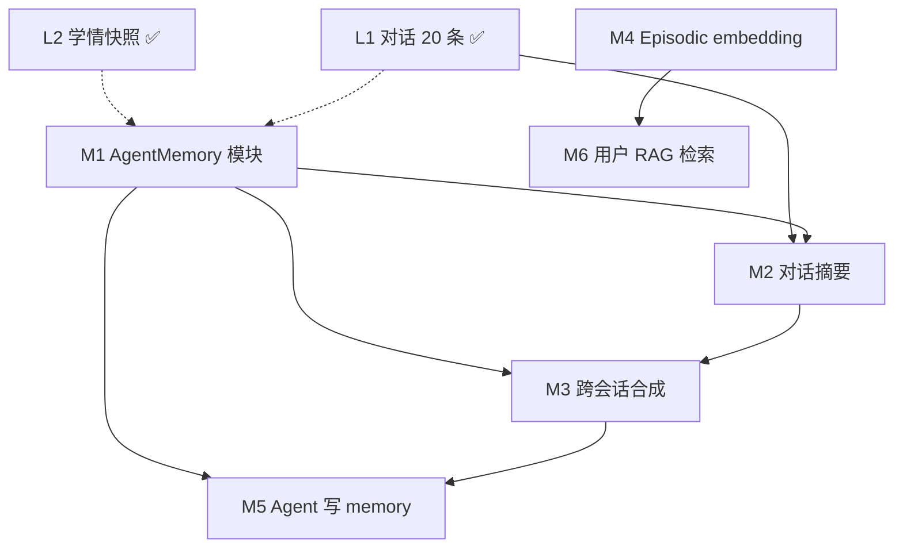

# Agent Memory 开发说明

> **真理来源**：本文档描述 Chat Agent 的记忆架构、已实现能力与六项待建设能力。  
> 代码入口见 `packages/core/src/ai/agent/runChatAgent.ts`。  
> 与 [PROJECT_REFERENCE.md](./PROJECT_REFERENCE.md) §7 P1、§11 待办对齐。

---

## 1. 概念界定

本项目 **没有** 独立的 `AgentMemory` 模块（待建设 M1）。当前「记忆效果」由以下机制叠加实现：

| 层级 | 类型 | 实现 | 状态 |
|------|------|------|------|
| L1 | 对话记忆（短期） | `conversations` + `conversation_messages`，最近 20 条 | ✅ 已实现 |
| L2 | 学情记忆（长期结构化） | `getLearnerContext` + `getAssistantContext` 注入 system prompt | ✅ 已实现 |
| L3 | 工具副作用 | `runChatAgent` 工具写 DB（plan/analyze/grade/错题） | ✅ 已实现 |
| L4 | 专用 Agent Memory | `packages/core/src/ai/memory/`（M1 已落地编排层；M2–M6 待建设） | 🚧 M1 已实现 |

**注意**：题库 RAG（`question_bank` + `text-embedding-v3`）仅用于批改/analyze 参考，**不是**用户 Agent Memory。

---

## 2. 已实现：当前数据流

```
POST /api/chat
  → loadMemory({ userId, subject, conversationId? })   // M1 统一读入口
       ├ getOrCreateConversation(userId, subject, conversationId?)
       ├ loadConversationMessages(userId, conversationId, limit=20)
       └ getAssistantContext(userId)          // 计划/错题/近7天练习快照，≤800 字
       → AgentMemory { conversationId, shortTerm, longTerm, episodic?, isColdStart }
  → runChatAgent({ history: shortTerm, assistantContext: longTerm, message })
       system = persona + 工具说明 + 学情快照
       messages = system + history + user
       → JSON 意图 → 工具执行 → 可选 synthesizeReply
  → appendTurn(ctx, { userMessage, assistantReply }, conversationId)  // 落 conversation_messages
  → { reply, conversationId, action? }
```

### 关键文件

| 职责 | 路径 |
|------|------|
| **Memory 编排层（M1）** | `packages/core/src/ai/memory/memory.ts` |
| Agent 编排 | `packages/core/src/ai/agent/runChatAgent.ts` |
| 学情快照 | `packages/core/src/learning/assistant-context.ts` |
| 学习者画像 | `packages/core/src/ai/learner/context.ts` |
| 会话读写 | `packages/core/src/learning/conversation.ts` |
| 消息持久化 | `packages/core/src/learning/persist.ts` |
| Web API | `apps/web/src/app/api/chat/route.ts`、`chat/history/route.ts` |
| iOS 客户端 | `packages/ios/ios-gaokao/.../ChatViewModel.swift` |

### 2.2 相关 DB 表

- `conversations` — 按用户/学科维度的会话
- `conversation_messages` — 单轮 user/assistant 消息
- `user_profiles`、`knowledge_mastery`、`learning_events` — 学情画像
- `study_plans`、`wrong_questions`、`practice_records` — Assistant 快照数据源

---

## 3. 六项待建设能力（Agent Memory 路线图）

以下六项 **均未实现**，实施前须先读本文档与 `schema.ts`，避免与现有 L1–L3 重复造轮子。

### M1 独立 `AgentMemory` 抽象/模块 ✅ 已实现

| 项 | 说明 |
|----|------|
| **目标** | 统一读写入口，替代散落在 `conversation.ts` / `assistant-context.ts` / prompt 拼接中的隐式逻辑 |
| **落点** | `packages/core/src/ai/memory/`（`types.ts` / `memory.ts` / `compose.ts` / `index.ts`） |
| **接口** | `loadMemory(ctx)` → `AgentMemory { conversationId, shortTerm, longTerm, episodic?, isColdStart }`；`appendTurn(ctx, turn, conversationId)`；`upsertFact`（M5 空桩） |
| **行为** | 编排层 on top，不改 `conversation.ts` / `assistant-context.ts` / `persist.ts` 内部实现；`/api/chat` 已切换为 `loadMemory` / `appendTurn` |
| **前向兼容** | `episodic?` 恒 `undefined`（M4 钩子）；`upsertFact` 类型化空桩（M5 领域） |
| **验收** | `/api/chat` 仅通过 Memory 模块取上下文；单测覆盖 cold start / 有历史 / 有学情（`memory.test.ts`，4 用例） |

### M2 超长对话压缩/摘要（超过 20 条）

| 项 | 说明 |
|----|------|
| **现状** | `loadConversationMessages` 硬编码 `limit=20`（`chat/route.ts`） |
| **目标** | 超出窗口的旧消息压缩为摘要块，再与最近 N 条 raw 消息一并注入 |
| **建议** | 表字段 `conversations.summary` 或独立 `conversation_summaries`；超阈值时异步/同步调用 `structuredCall(task: 'chat')` 生成摘要 |
| **优先级** | P1 |
| **验收** | 50+ 轮对话后 Agent 仍能引用早期达成的计划/结论；token 不超当前约 2 倍 |

### M3 跨会话记忆合成

| 项 | 说明 |
|----|------|
| **现状** | 会话按 `title=subject` 隔离；无「上周在数学对话里说过…」的跨 session 检索 |
| **目标** | 按 `user_id` 聚合多会话摘要或关键事实，注入 `getAssistantContext` 或 M1 的 `longTerm` |
| **建议** | 定期从各 `conversations` rollup；或维护 `user_memory_facts` 表 |
| **优先级** | P2 |
| **验收** | 新开会话时能引用其它学科/旧会话中用户明确说过的目标（如「下周一模」） |

### M4 向量 / Episodic Memory（用户经历 embedding）

| 项 | 说明 |
|----|------|
| **现状** | 仅 `question_bank` 有 pgvector；用户对话/批改/计划无向量索引 |
| **目标** | 对高价值事件（批改结论、计划、用户声明）做 embedding，按语义检索 Top-K 注入 prompt |
| **依赖** | `DASHSCOPE_API_KEY`（`text-embedding-v3`，与题库 RAG 同模型）；新表 + `match_user_memories` RPC |
| **优先级** | P2 |
| **验收** | 用户问「我哪类题错最多」时，能召回相关历史片段（不仅依赖 SQL 聚合快照） |

### M5 Agent 主动写/改 Memory 条目

| 项 | 说明 |
|----|------|
| **现状** | 工具只写业务表；Agent 不能显式 `remember("目标院校", "...")` |
| **目标** | 新工具如 `upsert_user_fact` / `forget_fact`；或从对话中自动抽取事实写入 M3/M4 存储 |
| **约束** | 须 `user_id` 隔离；RLS 或 service client + 显式校验；禁止写入其它用户 |
| **优先级** | P2 |
| **验收** | 用户说「记住我目标 985」后，新会话 system 快照含该事实；用户可要求删除 |

### M6 RAG 检索用户历史（区别于题库 RAG）

| 项 | 说明 |
|----|------|
| **现状** | `retrieveReferences` 仅查 `question_bank`（`packages/core/src/ai/rag/retrieve.ts`） |
| **目标** | 专用 `retrieveUserMemory({ query, userId, limit })`，检索 M4 中的用户 episodic 向量 |
| **与 #4 关系** | M4 负责写入与索引；M6 负责 Agent 读路径 |
| **优先级** | P2（依赖 M4） |
| **验收** | Chat Agent 在回答前可选调用用户 RAG；日志区分 `question_bank` vs `user_memory` 来源 |

---

## 4. 能力依赖关系



**建议实施顺序**：M1 → M2 → M3 / M5 → M4 → M6

---

## 5. 非目标（避免混淆）

| 项 | 说明 |
|----|------|
| 题库 RAG | 保持 `question_bank` 专用，不混入用户 memory |
| Redis 限流内存 | `rate-limit.ts` in-memory fallback，与 Agent 无关 |
| OCR 图片缓存 | `ocr.ts` 进程内 Map，非用户记忆 |
| DeepSeek native `tool_calls` | 属 Agent 协议迭代，见 PROJECT_REFERENCE §7 P1 #4，非 Memory 专项 |

---

## 6. 与 PROJECT_REFERENCE 对齐索引

| PROJECT_REFERENCE | 本文档 |
|-------------------|--------|
| §7 P1 Agent/Memory 扩展 | §3 六项能力 |
| §9 Chat Agent 数据流 | §2 |
| §11 待办「Agent Memory M1–M6」 | §3 验收标准 |
| §4.4 功能→API（chat） | §2 已实现路径 |

---

*文档版本：2026-08-05 · 对应当前工作区代码状态（M1 已落地）*
