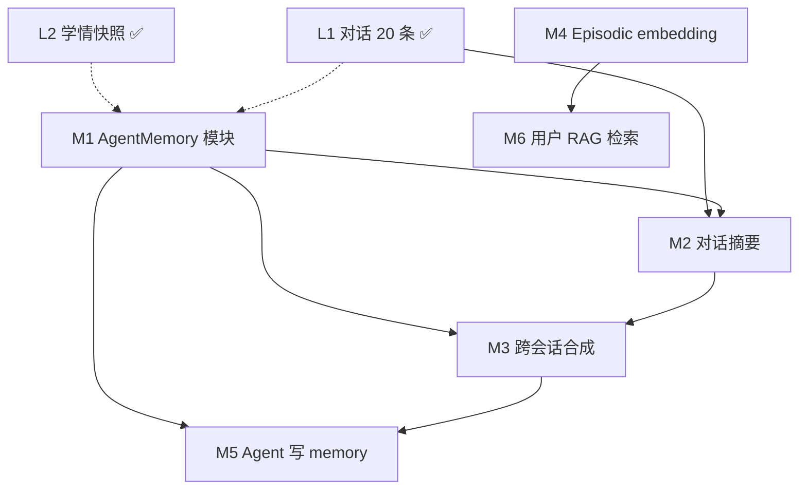

# Agent Memory 开发说明

> **真理来源**：本文档描述 Chat Agent 的记忆架构与六项能力（M1–M6 已全部落地）。  
> 代码入口见 `packages/core/src/ai/agent/runChatAgent.ts`。  
> 与 [PROJECT_REFERENCE.md](./PROJECT_REFERENCE.md) §7 P1、§11 待办对齐。

---

## 1. 概念界定

本项目的 Agent Memory 已有独立模块（`packages/core/src/ai/memory/`，M1–M6 全部已落地）。当前「记忆效果」由以下机制叠加实现：

| 层级 | 类型 | 实现 | 状态 |
|------|------|------|------|
| L1 | 对话记忆（短期） | `conversations` + `conversation_messages`，最近 20 条 | ✅ 已实现 |
| L2 | 学情记忆（长期结构化） | `getAssistantContext` 注入 system prompt（内部聚合 `getLearnerContext` 等） | ✅ 已实现 |
| L3 | 工具副作用 | `runChatAgent` 工具写 DB（plan/analyze/grade/错题） | ✅ 已实现 |
| L4 | 专用 Agent Memory | `packages/core/src/ai/memory/`（M1–M6 全部已落地） | ✅ 已实现 |

**注意**：题库 RAG（`question_bank` + `text-embedding-v3`）仅用于批改/analyze 参考，**不是**用户 Agent Memory。

---

## 2. 已实现：当前数据流

```
POST /api/chat
  → loadMemory({ userId, subject, conversationId? })   // M1 统一读入口
       ├ getOrCreateConversation(userId, subject, conversationId?)
       ├ [M2] countConversationMessages → 若 > 30 进入摘要分支
       │    ├ loadConversationMessages(20)            // 窗口内 raw
       │    ├ getConversationSummary + loadUnsummarizedOlderMessages
       │    └ summarizeConversation（LLM 摘要，失败回退）→ upsert conversation_summaries
       ├ getAssistantContext(userId)          // 计划/错题/近7天练习快照，≤800 字
       → AgentMemory { conversationId, shortTerm, longTerm(含摘要前缀), summary?, episodic?, isColdStart }
  → runChatAgent({ history: shortTerm, assistantContext: longTerm, message })
       system = persona + 工具说明 + 学情快照
       messages = system + history + user
       → JSON 意图 → 工具执行 → 可选 synthesizeReply
  → appendTurn(ctx, { userMessage, assistantReply }, conversationId)  // 落 conversation_messages
  → { reply, conversationId, action? }
```

### 关键文件

| 职责 | 路径 |
|------|------|
| **Memory 编排层（M1）** | `packages/core/src/ai/memory/memory.ts` |
| **对话摘要（M2）** | `packages/core/src/ai/memory/summary.ts` |
| **跨会话事实读写（M3/M5）** | `packages/core/src/ai/memory/facts.ts` |
| **用户经历向量（M4/M6）** | `packages/core/src/ai/memory/episodic.ts` |
| Agent 编排 | `packages/core/src/ai/agent/runChatAgent.ts` |
| 学情快照 | `packages/core/src/learning/assistant-context.ts` |
| 学习者画像 | `packages/core/src/ai/learner/context.ts` |
| 会话读写 | `packages/core/src/learning/conversation.ts` |
| 消息持久化 | `packages/core/src/learning/persist.ts` |
| Web API | `apps/web/src/app/api/chat/route.ts`、`chat/history/route.ts` |
| iOS 客户端 | `packages/ios/ios-gaokao/.../ChatViewModel.swift` |

### 2.2 相关 DB 表

- `conversations` — 按用户/学科维度的会话
- `conversation_messages` — 单轮 user/assistant 消息
- `user_profiles`、`knowledge_mastery`、`learning_events` — 学情画像
- `study_plans`、`wrong_questions`、`practice_records` — Assistant 快照数据源
- `question_bank` — 平台共享题库，经 **service client**（绕 RLS）读取，供批改/analyze RAG 参考；**非**用户 Agent Memory，亦不依赖 RLS

---

## 3. 六项已实现能力（Agent Memory 路线图）

以下六项均已实现。实施前仍须先读本文档与 `schema.ts`，避免与现有 L1–L3 重复造轮子。

### M1 独立 `AgentMemory` 抽象/模块 ✅ 已实现

| 项 | 说明 |
|----|------|
| **目标** | 统一读写入口，替代散落在 `conversation.ts` / `assistant-context.ts` / prompt 拼接中的隐式逻辑 |
| **落点** | `packages/core/src/ai/memory/`（`types.ts` / `memory.ts` / `compose.ts` / `index.ts`） |
| **接口** | `loadMemory(ctx)` → `AgentMemory { conversationId, shortTerm, longTerm, episodic?, isColdStart }`；`appendTurn(ctx, turn, conversationId)`；`upsertFact`（M1 落地时空桩，M5 已升级为真实写入） |
| **行为** | 编排层 on top，不改 `conversation.ts` / `assistant-context.ts` / `persist.ts` 内部实现；`/api/chat` 已切换为 `loadMemory` / `appendTurn` |
| **前向兼容** | `episodic?` 恒 `undefined`（M4 钩子）；`upsertFact` 已由 M5 升级为真实写入（见 M5） |
| **验收** | `/api/chat` 仅通过 Memory 模块取上下文；单测覆盖 cold start / 有历史 / 有学情（`memory.test.ts`，4 用例） |

### M2 超长对话压缩/摘要（超过 20 条）✅ 已实现

| 项 | 说明 |
|----|------|
| **现状** | ~~`loadConversationMessages` 硬编码 `limit=20`~~ 已在 `loadMemory` 内升级为滑动窗口 + 滚动摘要 |
| **目标** | 超出窗口的旧消息压缩为摘要块，再与最近 N 条 raw 消息一并注入 |
| **落点** | `packages/core/src/ai/memory/summary.ts`（`summarizeConversation` + 纯函数 `shouldSummarize`/`composeSummaryBlock`/`splitWindow`）；`memory.ts` `loadMemory` 接摘要分支 |
| **存储** | 独立 `conversation_summaries` 表（迁移 `0001_conversation_summaries.sql`），一个会话一个滚动摘要行 |
| **触发** | 同步懒触发：`loadMemory` 时 `count > SUMMARY_TRIGGER(30)` 才进入摘要分支，取窗口外未摘要消息调 LLM 生成/更新摘要 |
| **容错** | 摘要 LLM 故障 `console.warn` 后回退无摘要路径，不阻断主对话 |
| **行为保持** | `count <= 30` 走原路径（20 条 raw，无摘要），与 M1 完全等价；`runChatAgent` 签名不动，summary 拼入 `longTerm` 前缀 |
| **验收** | 50+ 轮对话后 Agent 仍能引用早期达成的计划/结论；token 不超当前约 2 倍；`summary.test.ts` 覆盖纯函数与边界 |

### M3 跨会话记忆合成 ✅ 已实现

| 项 | 说明 |
|----|------|
| **现状** | ~~会话按 `title=subject` 隔离；无跨 session 检索~~ 已落地 `user_memory_facts` 表（迁移 `0002`），按 `user_id` 聚合跨会话事实 |
| **目标** | 按 `user_id` 聚合多会话关键事实，注入 `longTerm`（M5 写入，M3 读出） |
| **落点** | `packages/core/src/ai/memory/facts.ts`（`loadUserFacts` + 纯函数 `composeUserFactsBlock`）；`memory.ts` `loadMemory` 并行加载事实并拼入 `longTerm` |
| **存储** | `user_memory_facts` 表（迁移 `0002_user_memory_facts.sql`），`user_id + key` 唯一，限 `MAX_USER_FACTS=12` 条注入 |
| **行为保持** | 无事实时 `composeUserFactsBlock` 返回空串，longTerm 与 M2 等价；isColdStart 现含「无学情且无事实」语义 |
| **验收** | 用户在 A 学科会话说「目标 985」→ M5 写入 → 新开 B 学科会话时 longTerm 含该事实（`facts.test.ts` 覆盖纯函数） |

### M4 向量 / Episodic Memory（用户经历 embedding）✅ 已实现

| 项 | 说明 |
|----|------|
| **现状** | ~~仅 `question_bank` 有 pgvector；用户对话/批改/计划无向量索引~~ 已落地 `user_memories` 向量表 + ivfflat 索引 + `match_user_memories` RPC |
| **目标** | 对高价值事件（批改结论、计划、用户声明）做 embedding，按语义检索 Top-K |
| **落点** | `packages/core/src/ai/memory/episodic.ts`（`storeUserMemory` 写入 + `embedUserMemory` 复用 `text-embedding-v3`）；`runChatAgent` 在 plan/grade/remember_fact 工具成功后异步写入 |
| **依赖** | `DASHSCOPE_API_KEY`（与题库 RAG 同模型）；迁移 `0003_user_memories.sql` |
| **容错** | embedding 失败时仍写入行（embedding 为 null），事件不丢；检索失败静默返回空，不阻断主对话 |
| **验收** | 批改/计划后 `user_memories` 有对应行；后续问「我哪类题错最多」可经语义召回相关历史片段 |

### M5 Agent 主动写/改 Memory 条目 ✅ 已实现

| 项 | 说明 |
|----|------|
| **现状** | ~~工具只写业务表；Agent 不能显式 `remember("目标院校", "...")`~~ 已落地 `remember_fact` / `forget_fact` 两个 Agent 工具 |
| **目标** | Agent 在对话中识别用户明确声明后，写入 M3 的 `user_memory_facts`；用户可要求删除 |
| **落点** | `runChatAgent` `executeTool` 新增 `remember_fact` / `forget_fact` 分支（调 `upsertUserFact` / `forgetUserFact`）；`memory.ts` `upsertFact` 从空桩升级为真实写入；`chatAgent` prompt 与 `chatAgentToolName` enum 扩展 |
| **约束** | `user_id` 隔离（service client + 显式 `eq('user_id', userId)`）；key/value 长度受限（zod 校验）；表 RLS 仅 `user_id = auth.uid()` |
| **验收** | 用户说「记住我目标 985」→ Agent 调 `remember_fact` → 下次新会话 longTerm 含该事实；用户说「忘掉目标」→ `forget_fact` 删除 |

### M6 RAG 检索用户历史（区别于题库 RAG）✅ 已实现

| 项 | 说明 |
|----|------|
| **现状** | ~~`retrieveReferences` 仅查 `question_bank`~~ 新增 `retrieveUserMemory({ query, userId, limit })`，检索 M4 用户 episodic 向量 |
| **目标** | Agent 读路径语义召回用户历史，注入 prompt（与题库 RAG 分离） |
| **落点** | `packages/core/src/ai/memory/episodic.ts` `retrieveUserMemory`（调 `match_user_memories` RPC）；`loadMemory` 非冷启动时召回 Top-3 拼入 `longTerm` 的 `【相关历史经历】` 块；`MemoryContext.query` 接收用户当前消息 |
| **与 #4 关系** | M4 负责写入与索引；M6 负责 Agent 读路径（已完成闭环） |
| **来源区分** | 题库走 `retrieveReferences`（`question_bank`）；用户记忆走 `retrieveUserMemory`（`user_memories`），两者表/RPC 独立 |
| **验收** | `loadMemory` 返回的 `episodic` 字段被填充；`composeEpisodicBlock` 拼入 longTerm；冷启动不触发召回 |

---

## 4. 能力依赖关系



**建议实施顺序**：M1 → M2 → M3 / M5 → M4 → M6  
**当前进度**：M1 ✅ → M2 ✅ → M3 ✅ → M5 ✅ → M4 ✅ → M6 ✅（六项全部落地）

---

## 5. 非目标（避免混淆）

| 项 | 说明 |
|----|------|
| 题库 RAG | 保持 `question_bank` 专用，不混入用户 memory |
| Redis 限流内存 | `rate-limit.ts` in-memory fallback，与 Agent 无关 |
| OCR 图片缓存 | `ocr.ts` 进程内 Map，非用户记忆 |
| DeepSeek native `tool_calls` | 属 Agent 协议迭代，见 PROJECT_REFERENCE §7 P1 #4，非 Memory 专项 |

---

## 6. 与 PROJECT_REFERENCE 对齐索引

| PROJECT_REFERENCE | 本文档 |
|-------------------|--------|
| §7 P1 Agent/Memory 扩展 | §3 六项能力 |
| §9 Chat Agent 数据流 | §2 |
| §11 待办「Agent Memory M1–M6」 | §3 验收标准 |
| §4.4 功能→API（chat） | §2 已实现路径 |

---

*文档版本：2026-08-10 · 对应当前工作区代码状态（M1–M6 全部已落地）*
